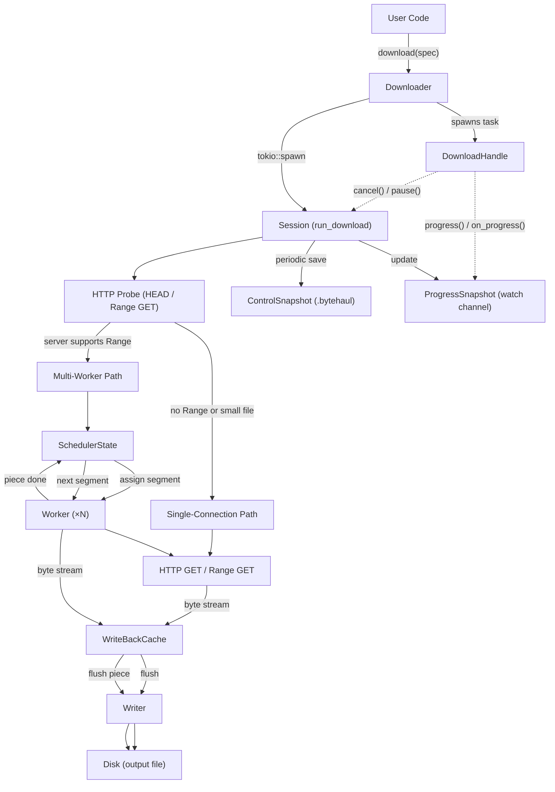

# Architecture

This document describes bytehaul's internal data-flow pipeline and the key abstractions involved.

## Overview

bytehaul is an async HTTP download library built on Tokio and reqwest. It supports multi-connection parallel downloading, resume via control files, write-back caching, and a configurable memory budget for back-pressure.

## Data-Flow Diagram

## Key Components

### Downloader / DownloaderBuilder

Entry point. Builds a shared `reqwest::Client` (with proxy, DNS, TLS settings) and an optional `Semaphore` for limiting concurrent downloads. Each call to `download()` spawns an independent Tokio task and returns a `DownloadHandle`.

### DownloadHandle

Provides the user-facing control surface:
- **`progress()`** — snapshot of current state via `watch::Receiver`
- **`on_progress(callback)`** — push-based progress notifications
- **`cancel()` / `pause()`** — cooperative cancellation via a shared `watch` channel
- **`wait()`** — awaits task completion

### Session (`run_download`)

Orchestration layer. Decides between single-connection and multi-worker paths based on server capabilities (Range support, Content-Length). Manages the control-file save loop and progress reporting.

### SchedulerState

Tracks piece assignment for multi-worker downloads. Wraps a `PieceMap` (bitset) and an in-flight exclusion set. Workers call `assign()` to get the next missing segment and `complete()` / `reclaim()` to update state.

### Worker

Each worker runs an HTTP Range GET for its assigned segment, streaming bytes into the `WriteBackCache`. On completion, it notifies the scheduler and requests the next piece.

### WriteBackCache

In-memory write buffer keyed by piece ID. Merges adjacent or overlapping byte ranges (coalescing) to minimize disk I/O. Flushed per-piece when a piece completes, or bulk-flushed when the memory budget high-watermark is reached.

### Writer

Translates `FlushBlock` entries into positioned writes (`pwrite` / `seek+write`) on the output file. Handles file pre-allocation (zero-fill or platform-native `fallocate`).

### ControlSnapshot

Binary control file (`.bytehaul`) for resume support. Format: 4-byte magic + 4-byte version + 4-byte payload length + 4-byte CRC32 + bincode payload. Saved periodically (configurable interval, default 5 s) via atomic write (tmp → fsync → rename).

### PieceMap

Compact bitset (`BitVec<u8, Lsb0>`) tracking per-piece completion status. Serialized into the control file for resume. Supports `to_bitset_bytes()` / `from_bitset()` for round-trip persistence.

## Memory Budget & Back-Pressure

The `memory_budget` setting (via `DownloadSpec`) controls a Tokio `Semaphore` that limits how many bytes the cache can hold before workers are blocked. When the cache exceeds the high-watermark, pending writes are suspended until the writer flushes data to disk, creating natural back-pressure from disk I/O speed.

## Retry & Resilience

Failed HTTP requests are retried with exponential back-off plus full jitter (`fastrand`). Configurable parameters: `max_retries`, `retry_base_delay`, `retry_max_delay`, `max_retry_elapsed`. On resume, the control file is validated (magic, version, CRC32) and corrupted files are discarded gracefully.
