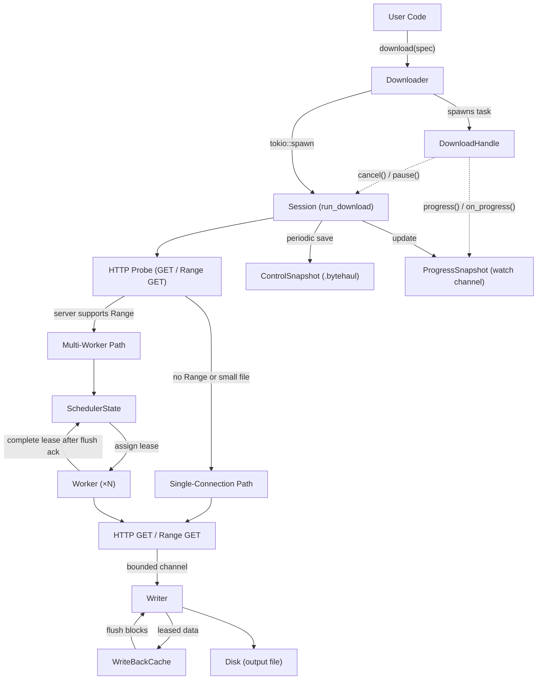

# Architecture

This document describes bytehaul's internal data-flow pipeline and the key abstractions involved.

[中文版](architecture.zh-CN.md)

## Overview

bytehaul is an async HTTP download library built on Tokio and a libcurl
transport driver. It supports multi-connection parallel downloading, resume
via control files, write-back cache, and a configurable memory budget for
back-pressure. libcurl is the sole production transport and is enabled by
default.

## Data-Flow Diagram

```mermaid
graph TD
    User["User Code"]
    Downloader["Downloader"]
    Handle["DownloadHandle"]
    Session["Session (run_download)"]
    Probe["HTTP Probe (GET / Range GET)"]
    Single["Single-Connection Path"]
    Multi["Multi-Worker Path"]
    Scheduler["SchedulerState"]
    Worker["Worker (×N)"]
    HTTP["HTTP GET / Range GET"]
    Cache["WriteBackCache"]
    Writer["Writer"]
    Disk["Disk (output file)"]
    Control["ControlSnapshot (.bytehaul)"]
    Progress["ProgressSnapshot (watch channel)"]

    User -->|"download(spec)"| Downloader
    Downloader -->|"spawns task"| Handle
    Handle -.->|"progress() / on_progress()"| Progress
    Handle -.->|"cancel() / pause()"| Session
    Downloader -->|"tokio::spawn"| Session

    Session --> Probe
    Probe -->|"server supports Range"| Multi
    Probe -->|"no Range or small file"| Single

    Single --> HTTP
    Multi --> Scheduler
    Scheduler -->|"assign lease"| Worker
    Worker --> HTTP
    HTTP -->|"bounded channel"| Writer
    Writer -->|"leased data"| Cache
    Cache -->|"flush blocks"| Writer
    Writer --> Disk
    Worker -->|"complete lease after flush ack"| Scheduler

    Session -->|"periodic save"| Control
    Session -->|"update"| Progress
```

## Key Components

### Downloader / DownloaderBuilder

Entry point. Holds downloader-wide default network settings plus a cache of
`BytehaulClient` instances built from the libcurl driver (proxy, DNS, TLS,
timeout and connection-pool policy). Each call to `download()` combines those
defaults with task-level overrides (timeout, connection pooling and proxies),
reuses or derives the matching client, and returns a `DownloadHandle`. An
optional `Semaphore` limits concurrent downloads.

DNS lookup and bounded TTL answer caching are provided by Hickory before a
libcurl transfer; the answer is injected with `CURLOPT_RESOLVE` so the URL,
Host and TLS identity remain unchanged.

### DownloadHandle

Provides the user-facing control surface:
- **`progress()`** — returns the current `ProgressSnapshot`; `subscribe_progress()` returns a `watch::Receiver` for updates
- **`on_progress(callback)`** — push-based progress notifications
- **`cancel()` / `pause()`** — cooperative cancellation via a shared `watch` channel
- **`wait()`** — awaits task completion

### Session (`run_download`)

Orchestration layer. Decides between single-connection and multi-worker paths based on server capabilities (Range support, Content-Length). Manages the control-file save loop and progress reporting.

### SchedulerState

Tracks piece assignment with a completion bitset, a compact availability index, and sparse runtime state for touched, incomplete pieces. Active lease and missing-range counts are maintained incrementally. Workers acquire complete pieces or missing subranges, then call `complete()` / `reclaim()` with a lease identity. Finishing a piece releases its detailed runtime state; checkpoint hints inspect only the sparse state.

### Worker

Each worker runs an HTTP Range GET for its assigned segment and forwards bytes through a bounded channel to the writer’s lease cache. It marks the lease complete in the scheduler only after the lease flush acknowledgement, then requests the next segment.

### WriteBackCache

In-memory write buffer keyed by lease identity. Each lease appends a contiguous byte stream; gaps and overlaps are internal errors. Retry attempts receive new identities so stale data cannot contaminate a new attempt. Data is flushed when the lease completes or the cache reaches its flush watermark. Bulk drains are sorted by file offset.

### Writer

Receives data through a bounded channel and tracks the file offset, seeking only for noncontiguous writes. Single connections coalesce adjacent small chunks until the 256 KiB threshold or session memory watermark; large chunks are written directly. Leased data keeps its isolated cache. Owned memory permits travel with queued data and remain with the writer until writing or discarding it; queue closure and writer failure also return permits automatically. Flush acknowledgements let workers mark leases complete, and sync acknowledgements establish checkpoint durability. File creation and preallocation live in `storage/file.rs`.

### ControlSnapshot

Binary control file (`.bytehaul`) for resume support. Format: 4-byte magic + 4-byte version + 4-byte payload length + 4-byte CRC32 + bincode payload. Saved periodically (configurable interval, default 5 s, gated by `autosave_sync_every`) via atomic write (tmp → fsync → rename). Multi-worker checkpoints freeze the completed bitset before awaiting the writer flush/sync barrier and save that frozen snapshot afterwards. Later completions wait for the next checkpoint. V1 and V2 reads remain supported; dirty/inflight hints are diagnostic, not resumable progress.

### PieceMap

Compact bitset (`BitVec<u8, Lsb0>`) tracking per-piece completion status. Serialized into the control file for resume. Supports `to_bitset_bytes()` / `from_bitset()` for round-trip persistence.

## Memory Budget & Back-Pressure

The `memory_budget` setting limits payload bytes reserved for the writer queue and cache through a Tokio semaphore. Response data is forwarded in bounded chunks, and the cache flush watermark leaves room for another chunk so budget acquisition cannot prevent the flush needed to release permits. Single and multi transfers observe pause/cancel while waiting for rate limits, budget, or the writer channel. This is a payload budget, not a bound on total process memory or HTTP/TLS receive buffers.

## Retry & Resilience

Retryable HTTP request failures and response-body transport errors share exponential back-off with equal jitter (`fastrand`). In single-connection mode, a body failure resumes only from the contiguous prefix confirmed by the writer flush barrier; a Range/metadata mismatch or an unprovable non-zero offset truncates the output before restarting from zero. `max_retries` means additional retries after the initial attempt (`0` disables retries). Configurable parameters: `max_retries`, `retry_base_delay`, `retry_max_delay`, `max_retry_elapsed`. On resume, the control file is validated (magic, version, CRC32) and corrupted files are discarded gracefully.

## Progress and Storage Failures

`ProgressSnapshot.downloaded` reports received bytes for the UI and may decrease during multi-worker retries. The control file records only the confirmed durable single-connection prefix or complete pieces. A final writer write or synchronization failure preserves the previous durable checkpoint, even if the UI byte count has reached the total size.

One download task owns its lifecycle from configuration validation through transfer, writer finalization and any configured verification. Transfer loops report bytes, speed and ETA only; the task itself publishes exactly one terminal state, derived from the result `wait()` returns: `Completed` on success, `Cancelled` / `Paused` for a stop request, `Failed` otherwise. A checksum mismatch therefore ends as `Failed` and is never preceded by a `Completed` snapshot. Single-connection completion requires a successful flush, writer close and required control-file cleanup; multi-connection completion requires successful final writer synchronization and all pieces complete, with control-file deletion best effort. Verification itself keeps observing stop requests. Callers should await the final `wait()` result, which includes any configured checksum verification.

## Configuration and unified multi-connection execution

`DownloadSpec` groups network overrides, retry, scheduling, recovery and storage internally while preserving its public builders and getters. The manager resolves network inheritance and passes the connection deadline with each request; DNS and connection establishment draw on the same budget. Shared clients use a 16-entry LRU, including the default client. Routing, TLS, DNS and pool settings remain part of the key; connection timeouts do not. Environment proxies are resolved at client creation, not cache hits. Eviction releases only the cache reference, allowing active requests to finish.

Every recovery mode and Fixed/Dynamic scheduling use the single loop in [worker.rs](../src/session/multi/worker.rs). The scheduler owns range allocation; the executor owns slots, leases, lineage retry budgets and writer settlement. [request.rs](../src/session/multi/worker/request.rs) validates finite ranges and consumes bodies across piece boundaries; [recovery.rs](../src/session/multi/worker/recovery.rs) returns recommendations. Disabled mode still supports dynamic planning and batching, without polling performance recovery decisions.

Single and multi-connection paths share rate, memory and channel waits through `MemoryBudget::forward_observed`. Multi-connection observations separate these local waits from network reads and writer barriers. Unknown-length and non-Range responses remain specific to the single-connection path.
