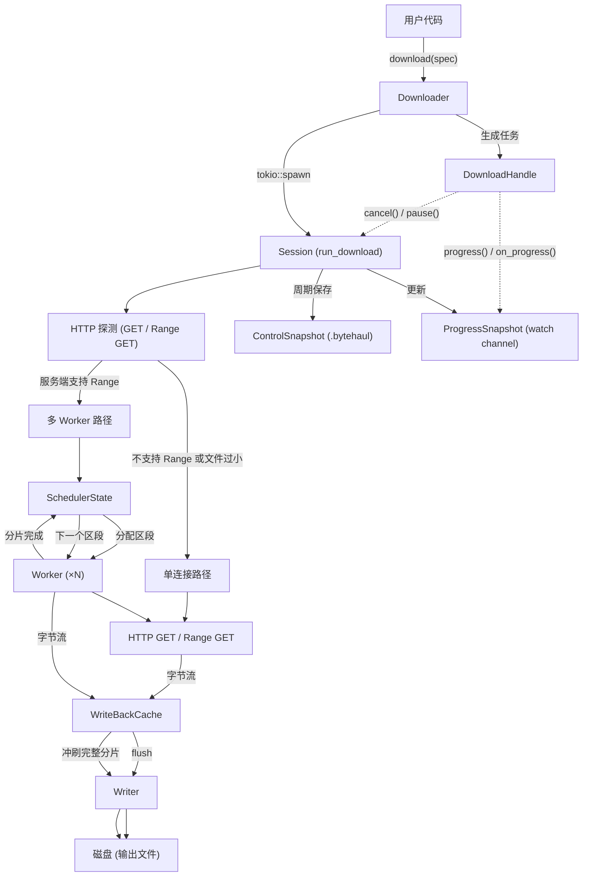

# bytehaul 架构说明

本文档介绍 bytehaul 的内部数据流管线以及参与下载流程的关键抽象。

[English Version](architecture.md)

## 概览

bytehaul 是一个基于 Tokio、hyper 和 hyper-rustls 构建的异步 HTTP 下载库。它支持多连接并行下载、通过控制文件实现断点续传、回写缓存，以及基于可配置内存预算的背压控制。

## 数据流示意图

## 关键组件

### Downloader / DownloaderBuilder

入口对象。它维护 downloader 级别的默认网络配置，以及一组按“生效网络配置”缓存的 `BytehaulClient`（内部基于 hyper client stack，并包含代理、DNS、TLS、超时等设置）。每次调用 `download()` 时，都会把默认值与任务级覆盖项（目前包括超时和代理）合并，复用或派生出匹配的 client，并返回一个 `DownloadHandle`。可选的 `Semaphore` 用于限制并发下载数。

### DownloadHandle

向用户暴露下载控制面：

- `progress()`：通过 `watch::Receiver` 读取当前进度快照
- `on_progress(callback)`：注册推送式进度回调
- `cancel()` / `pause()`：通过共享的 `watch` channel 协作取消或暂停
- `wait()`：等待任务结束

### Session (`run_download`)

编排层。它会根据服务端能力（是否支持 Range、是否有 Content-Length）在单连接路径和多 Worker 路径之间做选择，同时负责控制文件保存循环和进度上报。

### SchedulerState

负责跟踪多 Worker 下载时的分片分配状态。它内部包装了一个 `PieceMap`（位图）以及一个 in-flight 排除集合。Worker 通过 `assign()` 获取下一个缺失区段，并通过 `complete()` / `reclaim()` 回写状态。

### Worker

每个 Worker 都会针对自己拿到的区段发起一次 HTTP Range GET，请求返回的字节流会写入 `WriteBackCache`。区段完成后，Worker 会通知调度器并继续请求下一块分片。

### WriteBackCache

按分片 ID 组织的内存写缓冲区。它会合并相邻或重叠的字节区间，以减少磁盘 I/O 次数。分片完成时按分片冲刷；当内存预算达到高水位时，也会触发批量冲刷。

### Writer

将 `FlushBlock` 条目转换成带位置的文件写入（`pwrite` 或 `seek+write`）。同时负责输出文件的预分配，例如零填充或平台原生 `fallocate`。

### ControlSnapshot

用于续传的二进制控制文件（`.bytehaul`）。格式为：4 字节 magic + 4 字节 version + 4 字节 payload length + 4 字节 CRC32 + bincode payload。该文件会按周期保存（默认 5 秒，可配置），并通过原子写入流程落盘（tmp → fsync → rename）。

### PieceMap

紧凑位图（`BitVec<u8, Lsb0>`），用于记录每个分片是否已完成。它会被序列化进控制文件，用于断点续传，并支持通过 `to_bitset_bytes()` / `from_bitset()` 做往返持久化。

## 内存预算与背压

`DownloadSpec` 中的 `memory_budget` 设置控制一个 Tokio `Semaphore`，限制缓存区最多可持有多少字节。当缓存超过高水位时，Worker 会被阻塞，直到 Writer 将数据冲刷到磁盘，从而让磁盘 I/O 速度自然反向约束网络读取速度。

## 重试与韧性

失败的 HTTP 请求会采用指数退避并叠加完整抖动（`fastrand`）进行重试。可配置参数包括：`max_retries`、`retry_base_delay`、`retry_max_delay`、`max_retry_elapsed`。恢复下载时，控制文件会先做校验（magic、version、CRC32）；如果文件损坏，bytehaul 会安全地丢弃它并从头开始。