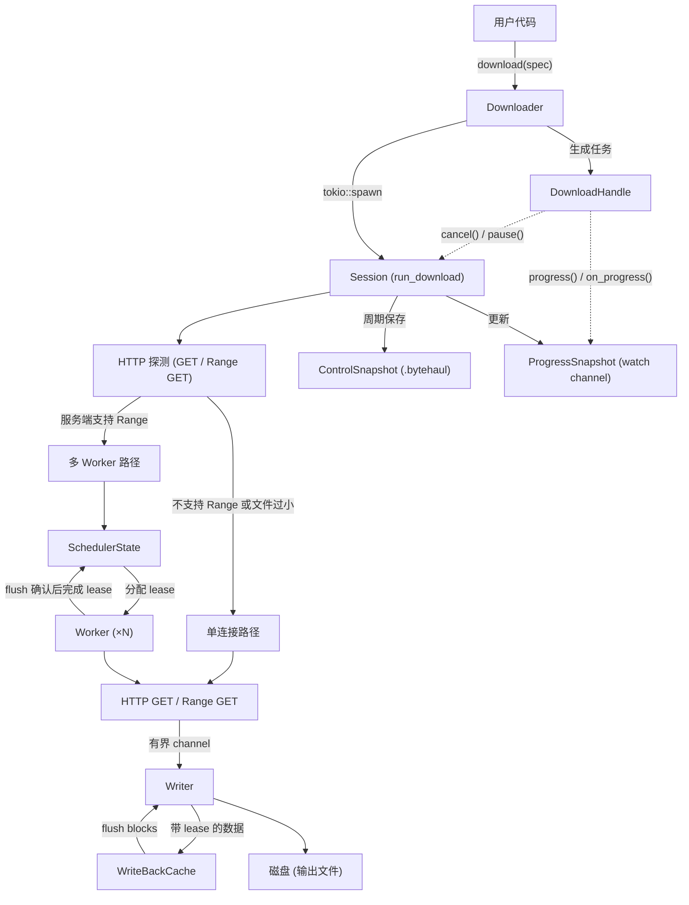

# bytehaul 架构说明

本文档介绍 bytehaul 的内部数据流管线以及参与下载流程的关键抽象。

[English Version](architecture.md)

## 概览

bytehaul 是一个基于 Tokio 和 libcurl 传输驱动构建的异步 HTTP 下载库。它支持多连接并行下载、通过控制文件实现断点续传、回写缓存，以及基于可配置内存预算的背压控制。libcurl 是唯一的生产传输后端，并由默认特性启用。

## 数据流示意图

```mermaid
graph TD
    User["用户代码"]
    Downloader["Downloader"]
    Handle["DownloadHandle"]
    Session["Session (run_download)"]
    Probe["HTTP 探测 (GET / Range GET)"]
    Single["单连接路径"]
    Multi["多 Worker 路径"]
    Scheduler["SchedulerState"]
    Worker["Worker (×N)"]
    HTTP["HTTP GET / Range GET"]
    Cache["WriteBackCache"]
    Writer["Writer"]
    Disk["磁盘 (输出文件)"]
    Control["ControlSnapshot (.bytehaul)"]
    Progress["ProgressSnapshot (watch channel)"]

    User -->|"download(spec)"| Downloader
    Downloader -->|"生成任务"| Handle
    Handle -.->|"progress() / on_progress()"| Progress
    Handle -.->|"cancel() / pause()"| Session
    Downloader -->|"tokio::spawn"| Session

    Session --> Probe
    Probe -->|"服务端支持 Range"| Multi
    Probe -->|"不支持 Range 或文件过小"| Single

    Single --> HTTP
    Multi --> Scheduler
    Scheduler -->|"分配 lease"| Worker
    Worker --> HTTP
    HTTP -->|"有界 channel"| Writer
    Writer -->|"带 lease 的数据"| Cache
    Cache -->|"flush blocks"| Writer
    Writer --> Disk
    Worker -->|"flush 确认后完成 lease"| Scheduler

    Session -->|"周期保存"| Control
    Session -->|"更新"| Progress
```

## 关键组件

### Downloader / DownloaderBuilder

入口对象。它维护 downloader 级别的默认网络配置，以及一组按“生效网络配置”缓存的 `BytehaulClient`（内部基于 libcurl driver，并包含代理、DNS、TLS、超时和连接池设置）。每次调用 `download()` 时，都会把默认值与任务级覆盖项（目前包括超时和代理）合并，复用或派生出匹配的 client，并返回一个 `DownloadHandle`。可选的 `Semaphore` 用于限制并发下载数。

DNS 查询和有容量限制的 TTL 响应缓存由 Hickory 负责；下载前得到的地址通过 `CURLOPT_RESOLVE` 注入 libcurl，同时保留 URL、Host 和 TLS 身份。

### DownloadHandle

向用户暴露下载控制面：

- `progress()`：返回当前 `ProgressSnapshot`；`subscribe_progress()` 返回用于订阅更新的 `watch::Receiver`
- `on_progress(callback)`：注册推送式进度回调
- `cancel()` / `pause()`：通过共享的 `watch` channel 协作取消或暂停
- `wait()`：等待任务结束

### Session (`run_download`)

编排层。它会根据服务端能力（是否支持 Range、是否有 Content-Length）在单连接路径和多 Worker 路径之间做选择，同时负责控制文件保存循环和进度上报。

### SchedulerState

通过完成位图、紧凑的可分配索引，以及仅为已触及且未完成的分片建立的稀疏状态跟踪任务。活动 lease 和缺失区间数量采用增量计数。Worker 领取完整分片或缺失子区间，携带 lease 身份调用 `complete()` / `reclaim()`。完整分片完成后释放详细状态；checkpoint 提示只遍历稀疏状态。

### Worker

每个 Worker 针对领取的区段发起 HTTP Range GET，并通过有界 channel 把数据交给 writer 的 lease 缓存。收到 lease flush 确认后，Worker 才通知调度器完成，并领取下一区段。

### WriteBackCache

按 lease 身份组织的内存写缓冲区。每个 lease 只接受连续追加的数据，间隙或重叠属于内部错误。重试使用新身份，避免旧 attempt 的迟到数据污染新数据。lease 完成或缓存达到刷盘水位时写盘；全量排出数据时按文件 offset 排序。

### Writer

通过有界 channel 接收数据，使用 `seek + write_all` 写入输出文件。单连接数据直接写盘，带 lease 的数据经过缓存。flush 确认允许 worker 标记 lease 完成，sync 确认则用于建立 checkpoint 持久化边界。文件创建与预分配位于 `storage/file.rs`。

### ControlSnapshot

用于续传的二进制控制文件（`.bytehaul`）。格式为：4 字节 magic + 4 字节 version + 4 字节 payload length + 4 字节 CRC32 + bincode payload。该文件按周期检查保存条件（默认 5 秒，并受 `autosave_sync_every` 控制），通过原子写入流程落盘（tmp → fsync → rename）。多 Worker 先截取完成位图，再等待 writer flush/sync，最后保存截取的快照；期间新增的完成状态留到下一次 checkpoint。保留 V1/V2 读取兼容，dirty/inflight 提示仅用于诊断，不算可续传进度。

### PieceMap

紧凑位图（`BitVec<u8, Lsb0>`），用于记录每个分片是否已完成。它会被序列化进控制文件，用于断点续传，并支持通过 `to_bitset_bytes()` / `from_bitset()` 做往返持久化。

## 内存预算与背压

`memory_budget` 通过 Tokio semaphore 限制为 writer 队列和缓存预留的数据字节数。响应数据分成有上限的小块转发，刷盘水位为后续数据块留出空间，避免 worker 等待预算、writer 等待更多数据的循环等待。单连接和多连接在限速、预算、channel 等待期间都响应暂停或取消。这是数据预算，不是进程总内存或 HTTP/TLS 接收缓冲区的上限。

## 重试与韧性

可重试的 HTTP 请求和响应体传输错误会采用统一的指数退避并叠加等抖动（equal jitter，`fastrand`）进行重试。单连接在 body 失败后只从 writer flush barrier 确认的连续前缀发起 Range 续传；Range/metadata 不匹配或无法证明非零偏移时会先清空输出再从零重启。`max_retries` 表示初次尝试之后允许的额外重试次数，`0` 表示不重试。可配置参数包括：`max_retries`、`retry_base_delay`、`retry_max_delay`、`max_retry_elapsed`。恢复下载时，控制文件会先做校验（magic、version、CRC32）；如果文件损坏，bytehaul 会安全地丢弃它并从头开始。

## 进度与存储失败

`ProgressSnapshot.downloaded` 用于显示已接收字节，多 Worker 重试时可能回退；控制文件只声明已确认持久化的单连接前缀或完整分片。最终 writer 写入或同步失败时保留此前的持久化断点，即使界面字节数已达到总大小。

每个下载任务从配置校验、传输、writer 收尾到配置的校验和检查都由同一处生命周期出口负责。传输循环只报告字节数、速度和 ETA，不发布公开状态；任务自身根据 `wait()` 返回的结果发布唯一一次终态：成功为 `Completed`，收到停止请求为 `Cancelled`/`Paused`，其余为 `Failed`。因此校验和不匹配会以 `Failed` 结束，之前不会出现 `Completed` 快照。单连接完成要求 flush、关闭 writer 和所需的控制文件清理全部成功；多连接要求最终同步成功并确认所有分片完成，控制文件删除是尽力而为。校验和计算过程同样响应停止请求。调用方应等待 `wait()` 的最终结果，其中已包含校验和检查。

## 配置与统一多连接执行

`DownloadSpec` 内部按网络覆盖、重试、调度、恢复和存储分组，公开 builder/getter 保持不变。manager 解析网络继承后为每个请求传递连接期限，DNS 与建连消耗同一个预算。共享 client 使用容量 16 的 LRU，默认 client 计入上限；key 保留路由、TLS、DNS 与 pool 配置，连接超时不属于共享身份。环境代理在 client 创建时解析，命中缓存不重读；淘汰只释放缓存引用，活动请求仍可完成。

所有恢复模式及 Fixed/Dynamic 调度都使用 [worker.rs](../src/session/multi/worker.rs) 的同一个执行循环。scheduler 拥有范围分配，执行器拥有 slot、lease、lineage 重试预算与 writer 确认；[request.rs](../src/session/multi/worker/request.rs) 负责有限 Range 校验与跨 piece body 消费；[recovery.rs](../src/session/multi/worker/recovery.rs) 只给出恢复建议。Disabled 模式仍支持动态规划和批处理，但不轮询性能恢复决策。

单连接与多连接共用 `MemoryBudget::forward_observed` 的限速、内存和 channel 等待。多连接分别观测这些本地等待、网络读取和 writer 屏障，避免将背压视为网络低速。未知长度与非 Range 的处理仍属于单连接路径。
